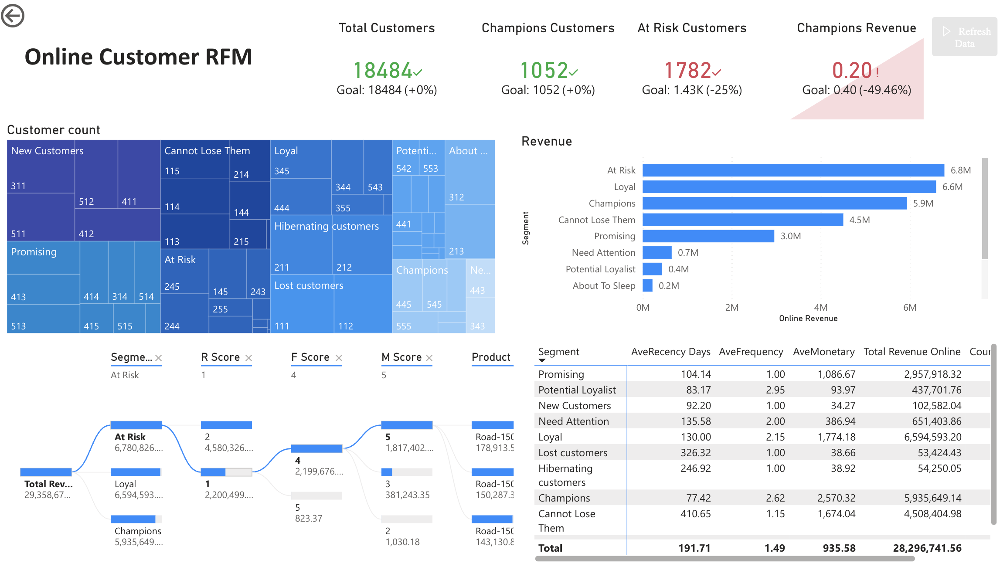

# Fictional Bike Sales Company – Analytics Data Platform

## Overview
This repository demonstrates how a **Data / BI Engineer** builds an analytics-ready data platform from a transactional OLTP system.

Using **Microsoft AdventureWorks 2022 (OLTP)** as the source, I implemented a **dbt-based ELT pipeline** and designed a **star schema** optimized for BI consumption, with **Power BI** as the downstream analytics layer.

---

## Engineering Focus
This project highlights:
- Translating **OLTP schemas → dimensional analytics models**
- Implementing **raw → staging → marts** using dbt (SQL-first ELT)
- Designing a **star schema** for scalable BI reporting
- Enforcing **data quality and referential integrity**
- Delivering **BI-ready tables with no downstream transformation logic**

---

## Data Architecture
AdventureWorks2022 (OLTP)
↓
Raw
↓
Staging
↓
Marts (Star Schema)
↓
Power BI

  
### Star Schema Model
- Fact table: `fact_sales`
- Dimensions:
  - Customer
  - Product
  - Reseller
  - Sales Territory
  - Date
  - RFM & Customer Segment (derived)

#### Fact Model: `fact_sales`
`fact_sales` is built at **sales order line grain** and serves as the single source of truth for transactional measures.

Key design choices:
- Revenue, cost, and profitability metrics are **computed once** in the marts layer.
- Online and reseller sales are unified in the same fact table, with channel-specific keys populated accordingly.
- Non-applicable dimensions are handled explicitly using placeholder keys (`-1`) to preserve referential integrity.

---

#### Dimensional Models
Core dimensions (customer, reseller, product, date, sales territory) provide descriptive context for slicing and filtering.

Design principles:
- One row per natural business entity
- Stable surrogate keys
- Attributes standardized and resolved in staging before dimensional modeling
- No business logic deferred to BI tools

---

#### Analytical Models: RFM & Customer Segmentation
RFM metrics and customer segments are **explicitly modeled analytical dimensions**, not inferred automatically.

- **Recency (R)** is defined as days since the customer's most recent purchase.
- **Frequency (F)** is defined as the number of distinct purchase dates.
- **Monetary (M)** is defined as total sales amount, with a log transformation applied to reduce skewness.

Customer segments are assigned based on explicitly defined RFM score combinations.
Each customer receives a three-digit RFM score (R, F, M ∈ {1,…,5}), which is mapped to a business segment as follows:

---

## Data Quality & Governance
Custom dbt tests validate:
- Primary key uniqueness
- Foreign key consistency between fact and dimensions
- Invalid business scenarios (e.g. negative prices, negative gross profit)
- Schema and analytical completeness (e.g. RFM coverage)

> Detailed transformation logic, model documentation, and tests are located in `/dbt`.

---

## Power BI Dashboards

### 1. Executive Performance
- Revenue
- Units sold
- Gross profit
- YoY comparison
- Time trend analysis

### 2. Product Profitability
- Margin vs scale analysis
- Category and subcategory breakdown
- Channel comparison (Online vs Reseller)
- Decomposition tree exploration

### 3. Online Customer RFM
- Recency, Frequency, Monetary modeling
- RFM score generation (1–5 scale per metric)
- Business-defined segment mapping
- Revenue contribution by segment

---

## Tech Stack
- **Cloud**: Azure  
- **Warehouse**: Azure SQL / Analytics DB  
- **Transformations**: dbt (SQL)  
- **Modeling**: Star Schema  
- **BI**: Power BI  
- **Version Control**: Git & GitHub  

---

## Notes
- Connection credentials (`profiles.yml`) are excluded from version control
- This repository focuses on **analytics engineering and data modeling**, not dashboard aesthetics

