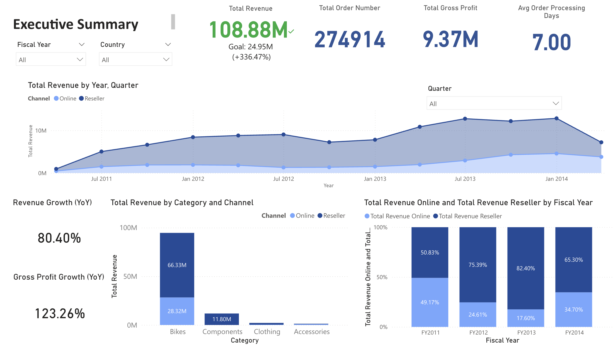
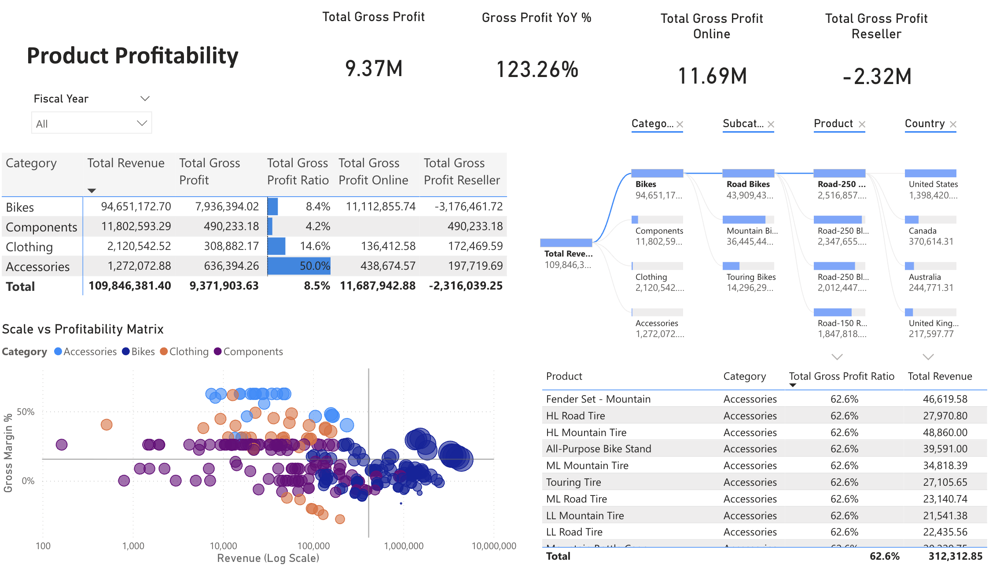

# Fictional Bike Sales Company – Analytics Data Platform

## Overview
This repository demonstrates how a **Data / BI Engineer** builds an analytics-ready analytics layer from a transactional OLTP system.

Using **Microsoft AdventureWorks 2022 (OLTP)** as the source, I implemented a **dbt-based ELT pipeline**, designed a **star schema** optimized for BI, and delivered **Power BI dashboards** on top of curated marts.

---

## Engineering Focus
This project highlights:
- Translating **OLTP schemas → dimensional analytics models**
- Implementing **raw → staging → marts** using dbt (SQL-first ELT)
- Designing a **star schema** for scalable BI reporting
- Enforcing **data quality and referential integrity** (dbt tests)
- Delivering **BI-ready tables** with minimal downstream transformation logic

---

## Data Architecture (High-Level)

AdventureWorks2022 (OLTP)  
↓  
Raw  
↓  
Staging  
↓  
Marts (Star Schema)  
↓  
Power BI  

- **Source**: AdventureWorks OLTP data is loaded into the analytics database.
- **Transform**: dbt builds **raw → staging → marts**, computing business metrics in the marts layer.
- **Consume**: Power BI connects **directly to marts** (semantic modeling + measures only).
- **Quality gate**: dbt tests catch key issues (PK/FK integrity, invalid scenarios) before BI consumption.

> Detailed transformation logic, model documentation, and tests are located in `/dbt`.

---

## Star Schema Model
- **Fact table**: `fact_sales`
- **Dimensions**:
  - Customer
  - Product
  - Reseller
  - Sales Territory
  - Date
  - RFM (derived)

### Fact Model: `fact_sales`
`fact_sales` is built at **sales order line grain** and serves as the single source of truth for transactional measures.

Key design choices:
- Revenue, cost, and profitability metrics are **computed once** in the marts layer.
- Online and reseller sales are unified in the same fact table, with channel-specific keys populated accordingly.
- Non-applicable dimensions are handled using placeholder keys (`-1`) to preserve referential integrity.

---

## Data Quality & Governance
Custom dbt tests validate:
- Primary key uniqueness
- Foreign key consistency between fact and dimensions
- Invalid business scenarios (e.g., negative prices, negative gross profit)
- Analytical completeness checks (e.g., RFM coverage)

---

## Power BI Dashboards

### 1. Executive Performance
- Revenue
- Units sold
- Gross profit
- YoY comparison
- Time trend analysis  

### 2. Product Profitability
- Margin vs scale analysis
- Category and subcategory breakdown
- Channel comparison (Online vs Reseller)
- Decomposition tree exploration  

### 3. Online Customer RFM
- Recency, Frequency, Monetary modeling
- RFM score generation (1–5 scale per metric)
- Revenue contribution by segment and drill-down  

---

## Tech Stack
- **Cloud**: Azure   
- **Transformations**: dbt (SQL)  
- **Modeling**: Star Schema  
- **BI**: Power BI  
- **Version Control**: Git & GitHub  

---

## Repository Guide
- `/dbt` – dbt models, tests, documentation
- `/bi` – Power BI screenshots and report assets

---

## Notes
- Connection credentials (`profiles.yml`) are excluded from version control.
- This repository focuses on **analytics engineering and data modeling**, not dashboard aesthetics.
