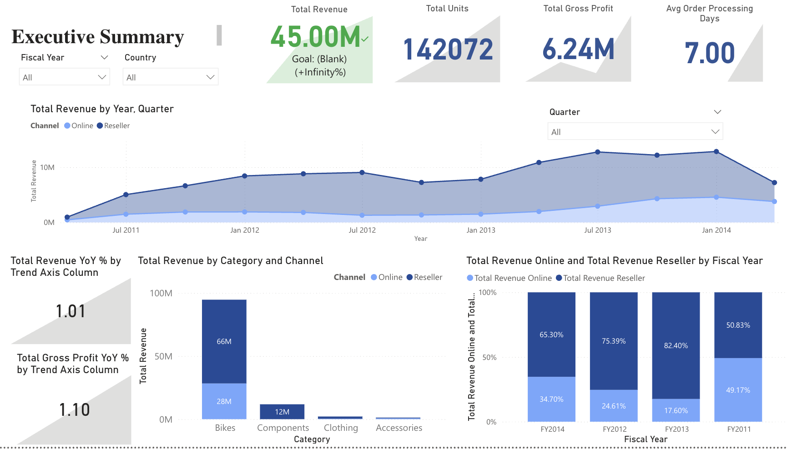
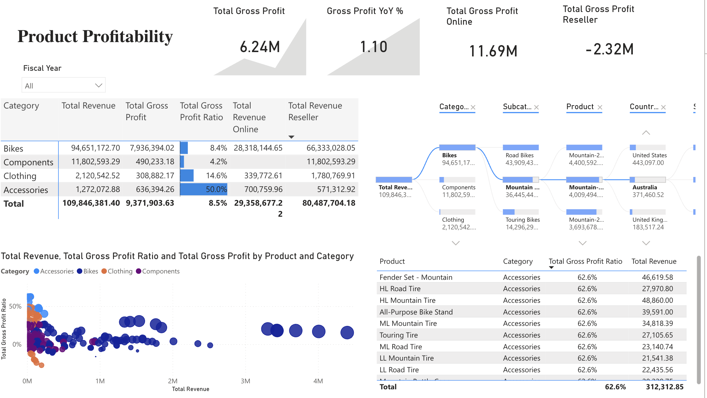
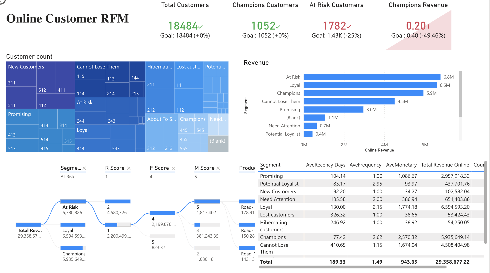

# Business Intelligence Layer

## Power BI Dashboard Overview

The Power BI report is organized into three main analytical views:

1. Executive Summary
2. Product Profitability
3. Online Customer RFM Analysis

---

## 1. Executive Summary

### Key Metrics
- Total Revenue
- Total Units Sold
- Total Gross Profit
- Average Order Processing Days
- Revenue and Gross Profit YoY %

### Analytical Focus
- Overall business performance by fiscal year and quarter
- Channel comparison between Online and Reseller sales
- Revenue composition by product category and channel
- Trend-level performance tracking (YoY growth)

### Key Observations
- Revenue growth is primarily driven by the reseller channel.
- Online sales contribute disproportionately to gross profit.
- Order processing time remains stable across periods.

### Business Implications
- Profitability improvement depends on scaling higher-margin online sales.
- Channel mix optimization is more impactful than volume growth alone.

---

## 2. Product Profitability

### Metrics Used
- Total Revenue
- Total Gross Profit
- Gross Profit Ratio
- Revenue split by Online vs Reseller

### Analytical Focus
- Profitability comparison across product categories and subcategories
- Identification of high-revenue but low-margin products
- Drill-down from category → product → country

### Key Observations
- Bikes generate the highest revenue but with moderate margins.
- Accessories show significantly higher gross profit ratios.
- Some high-volume products contribute limited profit.

### Business Implications
- Product portfolio optimization should prioritize margin, not just revenue.
- Accessories represent an opportunity for profit-focused growth.
- Pricing and cost structure for selected bike models may require review.

---

## 3. Online Customer RFM Analysis

### RFM Definition (Standardized in Analytics Layer)

- **Recency (R)**: Days since last purchase
- **Frequency (F)**: Number of distinct purchase dates
- **Monetary (M)**: Total sales amount (log-scaled)

Each dimension is scored from 1 to 5 using distribution-based thresholds.
The final RFM score is constructed as a three-digit code (e.g. 555).

### Customer Segmentation Logic

Customer segments are explicitly defined using RFM score mappings.
Segment definitions are standardized and version-controlled.

Examples:
- Champions: 555, 554, 545
- Loyal Customers: 444, 435, 355
- At Risk: 255, 254, 245
- Lost Customers: 111, 112

### Analytical Focus
- Distribution of customers across RFM segments
- Revenue contribution by customer segment
- Behavioral differences in recency, frequency, and monetary value

### Key Observations
- Champions and Loyal customers generate a disproportionate share of revenue.
- At Risk customers still contribute significant revenue but show declining engagement.
- Lost and Hibernating customers have minimal monetary impact.

### Business Implications
- Retention strategies should prioritize At Risk customers.
- Champions require loyalty reinforcement rather than discounting.
- Segment-based marketing enables targeted and cost-effective actions.

---

## Summary

The BI layer is intentionally lightweight and interpretation-focused.
All transformations, metric definitions, and segmentation logic are governed upstream,
ensuring consistency, scalability, and analytical integrity across reports.
